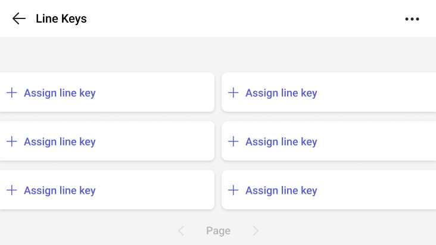

# Line keys on Microsoft Teams certified phones

This article provides you with guidance on setting up and managing line keys on Microsoft Teams certified phones. This feature allows your users to use a phone line key to set up line keys for quick access using buttons on touch, nontouch, and sidecar devices. These keys allow users to quickly access key calling features such as speed dial, shared lines, call queues, and collaborative delegation.

## Supported Devices 

Line keys are supported on:

- Nontouch Teams Phones  

- Touch Teams Phones (via the Line Keys app on the home screen)  

- Teams Phones with sidecars (for extended key capacity)

## Software Requirements 

To use line keys, devices must be running the following minimum Teams versions:  

- Nontouch devices: 1449/1.0.94.2024101709 or later 

- Touch devices: 1449/1.0.94.2025084203 or later 

- Sidecar support: 1449/1.0.94.2025165302 or later 

To set up a line key for speed dial, follow these steps:

## Update to required Teams app

After updating the phone, you notice a new home screen experience on your device with a dedicated place for your line keys. To update your Teams phones, see [Update your phones remotely](remote-update-teams-phones.md).  Verify that you're running the minimum Teams versions.

1. You can see the versioning information in the Teams admin center or on the Teams phone.

   To see it in the Teams admin center:

1. Sign in to the Teams admin center.

1. Go to **Teams devices** > **Phones** > then select the phone you want to look at.

1. Then in the table under **Software type** look for **Teams** and in the **Current version** column you can see the version.

   To see the versioning information on the Teams phone itself: Go to the **Profile** icon > **Settings** > **About**.
   
## Assignment of line keys

When you first start to assign line keys, you see available and unassigned line keys:

> [!NOTE]
> Line key assignment UI might differ on touch, nontouch, and sidecar devices.

1. Steps to assign line keys:

   1. Find an available line key on your device.
      
   1. Select Assign line key.
      
   1. Choose the type of assignment (for example, contact, shared line, call queue).
      
1. The following options are supported for assignment:

   1. Speed dial: Assign a frequently contacted person or external phone number.
      
   1. Shared line: Assign a shared line to monitor and pick up calls on behalf of another user.
      
   1. Collaborative call delegation: Assign a boss or delegate group to manage calls collaboratively.
      
   1. Call queue: Assign a call queue to monitor its status and pick up incoming calls.
      
   1. Call transfer: Assign a contact to enable one-touch transfer of active calls.
      
> [!IMPORTANT]
> Call queue and shared lines assignments on nontouch devices don't work as they're not supported.

## Management of line keys

Users can manage an assigned line key by selecting or long pressing the key. Management options include:  

- Assign: Add a new contact or number

- Unassign: Remove an existing assignment

- Reassign: Change the contact or number

- Manage: View and edit all line key assignments

Unassigned line keys can be hidden via the Calling settings menu. 

## Call handling assigned line keys

1. Speed Dial:  Assign frequently contacted numbers to line keys for one-touch dialing.

1. Shared Line:  Assign a shared line to a line key to:  

   1. View the presence of the boss and delegates.
      
   1. Pick up calls on behalf of the boss.
      
   1. Barge into active calls.
   
1. Collaborative Call Delegation:  Assign a group to a line key to:  

   1. View presence of the group members.
   
   1. Pick up incoming calls on behalf of others.
   
   1. Join active calls.
   
1. Call Queues:  Assign call queues to line keys to:  

   1. Monitor queue status (for example, available, active call).
   
   1. Pick up calls directly from the queue.
   
1. Call Transfers:  Assign a contact to a line key to enable one-touch transfer (including blind and consult transfer) of active calls.

## LED conventions of line keys 

LED indicators on line keys provide visual cues for call status:  

1. Solid green: Line is available.

1. Blinking red: Line has a call on hold.

1. Solid red: Line is busy or an active call.

1. Blinking green: Line is receiving and active call.

> [!NOTE]
> LED support will be introduced by device manufacturers— check with them directly for rollout timelines.

## Frequently Asked Question

**Question:**  Can line keys be configured on the Teams Admin Center with this update?  

**Answer:**  No, currently configuration support is only on the Teams phone.

**Question:**  What other functions can I perform using line keys?  

**Answer:**  With this update, you can use line keys for quick access to speed dial, assign shared lines, collaborative call delegation, call queues and call transfers. In the future, we'll support line keys for other call controls.

**Question:**  Does this change the existing functionality of sidecars?  

**Answer:**  No, the current functionality of the pinning of speed dial, shared lines, and group contacts doesn't change. However, you can now assign line keys to sidecars in addition to automatic syncing of speed dial, shared lines, and group contacts.

### Related articles

- [Microsoft Certified Teams phones](../devices/teams-phones-certified-hardware.md)

- [Phones for Microsoft Teams](phones-for-teams.md)

